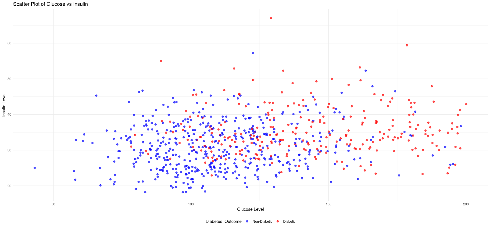

# Summative Assignment

**Due 21 Jul by 5:59**  
**Points 0**  
**Available 4 Jul at 6:00 - 21 Jul at 5:59**

---

### Course: R Programming for Data Science: Introduction

Please complete the following questions to test your understanding of the concepts covered in the "R Programming for Data Science: Introduction" course. Please submit your code/answers for each question after the question itself. Feel free to refer to the course material and conduct additional research as needed.

---

## Overview:

You are going to use a dataset that was collected and made freely available by the "National Institute of Diabetes and Digestive and Kidney Diseases" as part of the Pima Indians Diabetes Database. The dataset is available to download as part of this assignment via this link:

https://drive.google.com/file/d/1qDkGULtjrXw-H4OPXgPZH6PnVcPBHzYK/view?usp=sharing

The dataset contains the following variables (i.e. columns):

- Pregnancies: Number of times pregnant  
- Glucose: Plasma glucose concentration over 2 hours in an oral glucose tolerance test  
- BloodPressure: Diastolic blood pressure (mm Hg)  
- SkinThickness: Triceps skin fold thickness (mm)  
- Insulin: 2-Hour serum insulin (mu U/ml)  
- BMI: Body mass index (weight in kg/(height in m)2)  
- DiabetesPedigreeFunction: Diabetes pedigree function (a function which scores likelihood of diabetes based on family history)  
- Age: Age (years)  
- Outcome: 0 if non-diabetic, 1 if diabetic  

---

## Answer the following questions by writing and providing the required R code to perform the listed tasks (Please make sure you follow best coding practices explained throughout the course. Also, feel free to perform intermediary steps if you think they are needed):

1- Load the dataset, generate a numeric statistical summary of all its variables.

2- The dataset contains missing values. Sometimes those values are blank and some other times a question mark has been used to indicate them. If any variable has more than 20% of its values missing, drop that variable. 

3- For the remaining variables, Replace all missing values in each variable by the minimum value in that variable.

``` r

library(readr)

PIMA_PATH <- "Diabetes-data.csv"

#' Load PIMA Diabetes Dataset
#'
#' This function loads the PIMA Diabetes dataset from a specified CSV file path using `readr::read_csv`.
#'
#' @param file_path String path to the CSV file.
#' @param col_names Logical indicating if the first row contains column names (default is TRUE).
#'
#' @return A data frame containing the loaded dataset.
#'
#' @examples
#' load_dataset("Diabetes-data.csv")
load_dataset <- function(file_path, col_names = TRUE) {
  data_frame <- read_csv(file_path, col_names)
  return(data_frame)
}

#' Compute Statistical Mode
#'
#' This function computes the mode (most frequent value) of a vector, ignoring NAs by default.
#'
#' @param x A vector (numeric, character, or factor).
#' @param na.rm Logical indicating whether to ignore missing values. Default is FALSE.
#'
#' @return A single value representing the mode, or NA if no mode is found.
#'
#' @examples
#' stat_mode(c(1, 2, 2, 3, 3, 3, 4))
stat_mode <- function(x, na.rm = FALSE) {
  x <- na.omit(x)
  if (length(x) == 0) {
    return(NA)
  }
  model_value <- names(sort(table(value = x), decreasing = TRUE)[1])
}

#' Clean Missing Numeric Columns
#'
#' This function drops columns with more than 20% missing values (NAs) and replaces remaining NAs
#' in numeric columns with the column's minimum non-NA value.
#'
#' @param data_frame A data frame with possible missing values.
#'
#' @return A cleaned data frame with no columns over 20% NA and all remaining NAs filled with column minimums.
#'
#' @examples
#' clean_missing_numeric_columns(pima_df)
clean_missing_numeric_columns <- function(data_frame) {
  incomplete_numeric_columns <- c()
  for (col in names(data_frame)) {
    if (any(is.na(data_frame[[col]]))) {
      incomplete_numeric_columns <- c(incomplete_numeric_columns, col)
    }
  }
  for (col in incomplete_numeric_columns) {
    total_count <- length(data_frame[[col]])
    na_count <- sum(is.na(data_frame[[col]]))
    if ((na_count / total_count) > 0.20) {
      data_frame[[col]] <- NULL
    } else {
      min_value <- min(data_frame[[col]])
      data_frame[[col]][is.na(data_frame[[col]])] <- min_value
    }
  }
  return(data_frame)
}

#' Remove Rows Containing Zero Values in Key Columns
#'
#' This function scans each row and removes rows where any numeric column 
#' (except "Outcome" and "Pregnancies") contains a zero.
#'
#' @param data_frame A numeric data frame to clean.
#'
#' @return A data frame with rows containing zero values (in numeric columns, excluding "Outcome" and "Pregnancies") removed.
#'
#' @examples
#' clean_row_with_zero(pima_df)
clean_row_with_zero <- function(data_frame) {
  for (row in 1:nrow(data_frame)) {
    for (col in names(data_frame)) {
      if (!(col %in% c("Outcome", "Pregnancies")) &&
          is.numeric(data_frame[[col]])) {
        if (!is.na(data_frame[row, col]) && data_frame[row, col] == 0) {
          value <- data_frame[row, col]
          if (!is.na(value) && value == 0) {
            data_frame[row] <- NA  # Set the entire row to NA if a zero is found
          }
        }
      }
    }
  }
  data_frame <- na.omit(data_frame)
  return(data_frame)
}

#' Run Full Data Cleaning Pipeline
#'
#' This function loads the PIMA dataset, cleans it by removing columns with too many missing values,
#' replaces missing values, and drops rows with zero values in key columns. Then it prints a sample.
#'
#' @return None (prints cleaned data to console).
#'
#' @examples
#' runner()
runner <- function() {
  pima <- load_dataset(PIMA_PATH)
  pima <- clean_missing_numeric_columns(pima)
  cat("PIMA Sample Data after cleaning:", "\n")
  print.data.frame(clean_row_with_zero(pima))
}

runner()
```

Now the dataset should be full without any missing values.

| Pregnancies | Glucose | BloodPressure | SkinThickness | BMI  | DiabetesPedigreeFunction | Age | Outcome |
| ----------- | ------- | ------------- | ------------- | ---- | ------------------------ | --- | ------- |
| 6           | 148     | 72            | 35            | 33.6 | 0.627                    | 50  | 1       |
| 1           | 85      | 66            | 29            | 26.6 | 0.351                    | 31  | 0       |
| 8           | 183     | 64            | 0             | 23.3 | 0.672                    | 32  | 1       |
| 1           | 89      | 66            | 23            | 28.1 | 0.167                    | 21  | 0       |
| 0           | 137     | 40            | 35            | 43.1 | 2.288                    | 33  | 1       |
| 5           | 116     | 74            | 0             | 25.6 | 0.201                    | 30  | 0       |
| 3           | 78      | 50            | 32            | 31.0 | 0.248                    | 26  | 1       |
| 10          | 115     | 0             | 0             | 35.3 | 0.134                    | 29  | 0       |
| 2           | 197     | 70            | 45            | 30.5 | 0.158                    | 53  | 1       |
| 8           | 125     | 96            | 0             | NaN  | 0.232                    | 54  | 1       |


4- Some variables will contain 0 values but those values don’t make sense. In this dataset, 0 values only make sense in the Pregnancies and Outcome columns. Drop any row that contains one or more 0’s in any column(s) other than Pregnancies and Outcome.

5- Group the data based on the Outcome column and generate the mean and median values for all other columns.

``` r
library(dplyr)
library(tidyr)
library(readr)
library(styler)

PIMA_PATH <- "Diabetes-data.csv"
#' Load the PIMA Diabetes Dataset
#'
#' Loads a CSV file containing the PIMA diabetes dataset using `readr::read_csv`.
#'
#' @param file_path Path to the CSV file.
#' @param col_names Logical. Whether the first row contains column names. Default is TRUE.
#' @param display_type Logical. Whether to display column type messages. Default is FALSE.
#'
#' @return A data frame containing the loaded dataset.
#'
#' @examples
load_dataset <- function(file_path,
                         col_names = TRUE,
                         display_type = FALSE) {
  data_frame <- read_csv(file_path, col_names = col_names, show_col_types = display_type)
  return(data_frame)
}

#' Calculate the Statistical Mode
#'
#' Computes the mode (most frequent value) of a numeric or character vector.
#'
#' @param x A vector (numeric, character, or factor).
#' @param na.rm Logical. Whether to ignore missing values. Default is FALSE.
#'
#' @return The most frequent value in the vector, or NA if input is empty after NA removal.
#'
#' @examples
#' stat_mode(c(1, 2, 2, 3))
stat_mode <- function(x, na.rm = FALSE) {
  x <- na.omit(x)
  if (length(x) == 0) {
    return(NA)
  }
  model_value <- names(sort(table(value = x), decreasing = TRUE)[1])
}

#' Clean Columns with Missing Values
#'
#' Identifies columns with missing values. If more than 20% of the values in a column are missing,
#' the column is dropped. Otherwise, missing values are replaced with the column's minimum value.
#'
#' @param data_frame A data frame containing numeric columns with missing values.
#'
#' @return A cleaned data frame with imputed or removed columns as appropriate.
#'
#' @examples
#' clean_missing_numeric_columns(pima_df)
clean_missing_numeric_columns <- function(data_frame) {
  incomplete_numeric_columns <- c()
  for (col in names(data_frame)) {
    if (any(is.na(data_frame[[col]]))) {
      incomplete_numeric_columns <- c(incomplete_numeric_columns, col)
    }
  }
  for (col in incomplete_numeric_columns) {
    total_count <- length(data_frame[[col]])
    na_count <- sum(is.na(data_frame[[col]]))
    if ((na_count / total_count) > 0.20) {
      data_frame[[col]] <- NULL
    } else {
      min_value <- min(data_frame[[col]])
      data_frame[[col]][is.na(data_frame[[col]])] <- min_value
    }
  }
  return(data_frame)
}


#' Remove Rows with Zero Values in Key Columns
#'
#' Iterates through the data frame and flags rows where any numeric column (except for 'Outcome' or 'Pregnancies')
#' contains a zero. The rows are retained in the current implementation but flagged for exclusion logic.
#'
#' @param data_frame A data frame to be processed.
#'
#' @return A data frame with rows containing zero values (in numeric columns, excluding "Outcome" and "Pregnancies") removed.
#'
#' @examples
#' clean_row_with_zero(pima_df)
clean_row_with_zero <- function(data_frame) {
  for (row in 1:nrow(data_frame)) {
    for (col in names(data_frame)) {
      if (!(col %in% c("Outcome", "Pregnancies")) &&
        is.numeric(data_frame[[col]])) {
        if (!is.na(data_frame[row, col]) && data_frame[row, col] == 0) {
          value <- data_frame[row, col]
          if (!is.na(value) && value == 0) {
            data_frame[row] <- NA  # Set the entire row to NA if a zero is found
          }
        }
      }
    }
  }
  data_frame <- na.omit(data_frame)
  return(data_frame)
}

#' Execute Full Preprocessing and Generate Summary Table
#'
#' Loads, cleans, and preprocesses the PIMA dataset. Cleans missing values, removes problematic rows,
#' and generates a pivot table grouped by `Outcome` showing mean and median for each numeric variable.
#'
#' @return No return value. Prints summary table to console.
#'
#' @examples
#' runner()
runner <- function() {
  pima <- load_dataset(PIMA_PATH)
  pima <- clean_missing_numeric_columns(pima)
  pima <- clean_row_with_zero(pima)
  pima_outcome_pivot <- pima %>%
    group_by(Outcome) %>%
    summarise(across(
      where(is.numeric) & !matches("Outcome"),
      list(
        mean = ~ mean(.x, na.rm = TRUE),
        median = ~ median(.x, na.rm = TRUE)
      ),
      .names = "{.col}_{.fn}"
    ))
  cat("\nPIMA Outcome Pivot Table:", "\n")
  print.data.frame(pima_outcome_pivot)
}
runner()
```
| Outcome | Pregnancies_mean | Pregnancies_median | BloodPressure_mean | BloodPressure_median | SkinThickness_mean | SkinThickness_median | BMI_mean | BMI_median |
| ------- | ---------------- | ------------------ | ------------------ | -------------------- | ------------------ | -------------------- | -------- | ---------- |
| 0       | 3.298            | 2                  | 68.184             | 70                   | 19.664             | 21                   | 30.85967 | 30.1       |
| 1       | 4.865672         | 4                  | 70.82463           | 74                   | 22.16418           | 27                   | 35.40677 | 34.3       |


6- Generate a heatmap plot that shows the correlation values between all variables in the dataset.

``` r

library(dplyr)
library(tidyr)
library(readr)
library(styler)
library(reshape2)
library(ggplot2)

PIMA_PATH <- "Diabetes-data.csv"
#' Load the PIMA Diabetes Dataset
#'
#' Loads the PIMA dataset from a CSV file using `readr::read_csv`.
#'
#' @param file_path String. Path to the dataset file.
#' @param col_names Logical. Indicates whether the first row contains column names. Default is TRUE.
#' @param display_type Logical. If TRUE, displays column type messages. Default is FALSE.
#'
#' @return A data frame containing the loaded data.
#'
#' @examples
load_dataset <- function(file_path,
                         col_names = TRUE,
                         display_type = FALSE) {
  data_frame <- read_csv(file_path, col_names = col_names, show_col_types = display_type)
  return(data_frame)
}


#' Calculate the Mode of a Vector
#'
#' Computes the most frequently occurring value in a vector.
#'
#' @param x A numeric or character vector.
#' @param na.rm Logical. If TRUE, missing values are removed. Default is FALSE.
#'
#' @return The mode (most frequent value), or NA if input is empty after NA removal.
#'
#' @examples
#' stat_mode(c(1, 1, 2, 3))  # returns 1
stat_mode <- function(x, na.rm = FALSE) {
  x <- na.omit(x)
  if (length(x) == 0) {
    return(NA)
  }
  model_value <- names(sort(table(value = x), decreasing = TRUE)[1])
}

#' Clean Columns with Missing Data
#'
#' Drops columns with more than 20% missing values. Fills remaining missing values
#' with the minimum value of that column.
#'
#' @param data_frame A data frame with possible missing values.
#'
#' @return A cleaned data frame with NA values handled or dropped.
#'
#' @examples
#' clean_missing_numeric_columns(pima_df)
clean_missing_numeric_columns <- function(data_frame) {
  incomplete_numeric_columns <- c()
  for (col in names(data_frame)) {
    if (any(is.na(data_frame[[col]]))) {
      incomplete_numeric_columns <- c(incomplete_numeric_columns, col)
    }
  }
  for (col in incomplete_numeric_columns) {
    total_count <- length(data_frame[[col]])
    na_count <- sum(is.na(data_frame[[col]]))
    if ((na_count / total_count) > 0.20) {
      data_frame[[col]] <- NULL
    } else {
      min_value <- min(data_frame[[col]])
      data_frame[[col]][is.na(data_frame[[col]])] <- min_value
    }
  }
  return(data_frame)
}

#' Remove Rows with Zeroes in Numeric Variables
#'
#' Scans all numeric variables (excluding 'Outcome' and 'Pregnancies') and flags rows
#' containing 0 values for review. Currently retains all rows.
#'
#' @param data_frame A data frame to be checked.
#'
#' @return A data frame with rows containing zero values (in numeric columns, excluding "Outcome" and "Pregnancies") removed.
#'
#' @examples
#' clean_row_with_zero(pima_df)
clean_row_with_zero <- function(data_frame) {
  for (row in 1:nrow(data_frame)) {
    for (col in names(data_frame)) {
      if (!(col %in% c("Outcome", "Pregnancies")) &&
        is.numeric(data_frame[[col]])) {
        if (!is.na(data_frame[row, col]) && data_frame[row, col] == 0) {
          value <- data_frame[row, col]
          if (!is.na(value) && value == 0) {
            data_frame[row] <- NA  # Set the entire row to NA if a zero is found
          }
        }
      }
    }
  }
  data_frame <- na.omit(data_frame)
  return(data_frame)
}

#' Main Processing Pipeline for PIMA Dataset
#'
#' Executes full data preparation: loading, cleaning missing values, filtering rows,
#' and generating a correlation heatmap.
#'
#' Steps include:
#' - Reading the dataset
#' - Removing columns with >20% missing values
#' - Imputing remaining NAs with column minimums
#' - Dropping rows with zero values in numeric columns
#' - Computing pairwise correlations (excluding NA-only columns)
#' - Displaying a heatmap of variable correlations using ggplot2
#'
#' @return No return value. Displays a correlation heatmap using ggplot2.
#'
#' @examples
#' runner()
runner <- function() {
  pima <- load_dataset(PIMA_PATH)
  pima <- clean_missing_numeric_columns(pima)
  pima <- clean_row_with_zero(pima)
  pima <- pima %>%
    select(where(is.numeric)) %>%
    select(where(~ !all(is.na(.x))))
  corelation_matrix <- cor(pima, use = "complete.obs")
  corelation_dataframe <- as.data.frame(as.table(corelation_matrix)) %>%
    filter(Var1 != Var2) %>%
    arrange(desc(Freq))
  colnames(corelation_dataframe) <- c("Var1", "Var2", "Correlation")
  ggplot(corelation_dataframe, aes(x = Var1, y = Var2, fill = Correlation)) +
    geom_tile(color = "white") +
    scale_fill_gradient2(
      low = "blue",
      mid = "yellow",
      high = "red"
    ) +
    labs(title = "Correlation Heatmap of PIMA Variables", x = NULL, y = NULL) +
    theme(axis.text.x = element_text(angle = 45, hjust = 1))
}
runner()

```


7- Generate a scatter plot showing Glucose in the x-axis and BMI in the y-axis. Colourise the markers by Outcome (e.g. markers representing diabetic individuals should be red and markers representing non-diabetic individuals should be blue).

``` r
library(dplyr)
library(tidyr)
library(readr)
library(styler)
library(reshape2)
library(ggplot2)


PIMA_PATH <- "Diabetes-data.csv"
#' Load the PIMA Diabetes Dataset
#'
#' Reads a CSV file into a data frame using readr. Optionally displays column type information.
#'
#' @param file_path String. Path to the CSV file.
#' @param col_names Logical. Whether the file contains header names. Default_
load_dataset <- function(file_path,
                         col_names = TRUE,
                         display_type = FALSE) {
  data_frame <- read_csv(file_path, col_names = col_names, show_col_types = display_type)
  return(data_frame)
}


#' Calculate the Mode of a Vector
#'
#' Returns the most frequent (modal) value in the vector, ignoring NA values.
#'
#' @param x A numeric or character vector.
#' @param na.rm Logical. If TRUE, missing values are removed before calculation.
#'
#' @return The mode (most common value) of the vector. Returns NA if no values are present.
stat_mode <- function(x, na.rm = FALSE) {
  x <- na.omit(x)
  if (length(x) == 0) {
    return(NA)
  }
  model_value <- names(sort(table(value = x), decreasing = TRUE)[1])
}

#' Handle Missing Values in Numeric Columns
#'
#' Checks for missing values in each column. If more than 20% are missing, the column is dropped.
#' Otherwise, missing values are replaced with the column's minimum value.
#'
#' @param data_frame A data frame with possible NA values.
#'
#' @return A cleaned data frame with no columns having >20% missing values, and missing values imputed.
clean_missing_numeric_columns <- function(data_frame) {
  incomplete_numeric_columns <- c()
  for (col in names(data_frame)) {
    if (any(is.na(data_frame[[col]]))) {
      incomplete_numeric_columns <- c(incomplete_numeric_columns, col)
    }
  }
  for (col in incomplete_numeric_columns) {
    total_count <- length(data_frame[[col]])
    na_count <- sum(is.na(data_frame[[col]]))
    if ((na_count / total_count) > 0.20) {
      data_frame[[col]] <- NULL
    } else {
      min_value <- min(data_frame[[col]])
      data_frame[[col]][is.na(data_frame[[col]])] <- min_value
    }
  }
  return(data_frame)
}

#' Placeholder Loop for Zero-Value Checking
#'
#' Iterates through numeric columns (except 'Outcome' and 'Pregnancies') to examine rows with 0 values.
#' Does not currently filter out rows — this may be intended for validation or inspection logic.
#'
#' @param data_frame The input data frame to be checked.
#'
#' @return A data frame with rows containing zero values (in numeric columns, excluding "Outcome" and "Pregnancies") removed.
clean_row_with_zero <- function(data_frame) {
  for (row in 1:nrow(data_frame)) {
    for (col in names(data_frame)) {
      if (!(col %in% c("Outcome", "Pregnancies")) &&
        is.numeric(data_frame[[col]])) {
        if (!is.na(data_frame[row, col]) && data_frame[row, col] == 0) {
          value <- data_frame[row, col]
          if (!is.na(value) && value == 0) {
            data_frame[row] <- NA  # Set the entire row to NA if a zero is found
          }
        }
      }
    }
  }
  data_frame <- na.omit(data_frame)
  return(data_frame)
}

#' Placeholder Loop for Zero-Value Checking
#'
#' Iterates through numeric columns (except 'Outcome' and 'Pregnancies') to examine rows with 0 values.
#' Does not currently filter out rows — this may be intended for validation or inspection logic.
#'
#' @param data_frame The input data frame to be checked.
#'
#' @return The unchanged input data frame.
runner <- function() {
  pima <- load_dataset(PIMA_PATH)
  pima <- clean_missing_numeric_columns(pima)
  pima <- clean_row_with_zero(pima)
  pima[pima == "?"] <- NA
  pima[pima == ""] <- NA
  pima$Glucose <- as.numeric(pima$Glucose)
  pima <- pima %>%
    filter(!is.na(Glucose), !is.na(BMI))
  pima <- pima %>% mutate(GlucoseGroup = cut(Glucose, breaks = seq(0, 200, by = 10)))
  ggplot(pima, aes(
    x = Glucose,
    y = BMI,
    color = factor(Outcome)
  )) +
    geom_jitter(
      width = 1.5,
      height = 0,
      alpha = 0.7,
      size = 2
    ) +
    labs(
      title = "Scatter Plot of Glucose vs Insulin",
      x = "Glucose Level",
      y = "Insulin Level",
      color = "Diabetes Outcome"
    ) +
    scale_color_manual(
      values = c("0" = "blue", "1" = "red"),
      name = "Diabetes  Outcome",
      labels = c("Non-Diabetic", "Diabetic")
    ) +
    theme_minimal() +
    theme(legend.position = "bottom")
}
runner()
```



8- Create a new column in the dataset to categorise BMI into groups. For example, you can create three categories: "Underweight" for BMI < 23, "Normal Weight" for BMI between 23 to 29 inclusive, and "Overweight" for BMI > 29. You can choose your own range of values if you wish but make sure you avoid weight value overlapping and ambiguity.

| Pregnancies | Glucose | BloodPressure | SkinThickness | BMI  | DiabetesPedigreeFunction | Age | Outcome | Category      |
| ----------- | ------- | ------------- | ------------- | ---- | ------------------------ | --- | ------- | ------------- |
| 6           | 148     | 72            | 35            | 33.6 | 0.627                    | 50  | 1       | Overweight    |
| 1           | 85      | 66            | 29            | 26.6 | 0.351                    | 31  | 0       | Normal Weight |
| 8           | 183     | 64            | 0             | 23.3 | 0.672                    | 32  | 1       | Normal Weight |
| 1           | 89      | 66            | 23            | 28.1 | 0.167                    | 21  | 0       | Normal Weight |
| 0           | 137     | 40            | 35            | 43.1 | 2.288                    | 33  | 1       | Overweight    |
| 5           | 116     | 74            | 0             | 25.6 | 0.201                    | 30  | 0       | Normal Weight |


9- Group the data by BMI category and calculate the percentage of individuals with diabetes within each category. Your code should display the BMI categories and the corresponding percentage of individuals with diabetes.

| Category      | Count | Diabetes_Outcome | Percentage |
| ------------- | ----- | ---------------- | ---------- |
| Normal Weight | 204   | 38               | 18.6       |
| Overweight    | 503   | 227              | 45.1       |
| Underweight   | 50    | 1                | 2.0        |

Code for Both 8 and 9

``` r
library(dplyr)
library(tidyr)
library(readr)
library(styler)
library(reshape2)
library(ggplot2)


PIMA_PATH <- "Diabetes-data.csv"

#' Load the PIMA Diabetes Dataset
#'
#' Loads the PIMA dataset from a CSV file using `readr::read_csv`.
#'
#' @param file_path String. Path to the dataset file.
#' @param col_names Logical. Indicates if the first row contains column names. Default is TRUE.
#' @param display_type Logical. If TRUE, displays column type messages. Default is FALSE.
#'
#' @return A data frame containing the loaded data.
#'
#' @examples
#' load_dataset("Diabetes-data.csv")
load_dataset <- function(file_path,
                         col_names = TRUE,
                         display_type = FALSE) {
  data_frame <- read_csv(file_path, col_names = col_names, show_col_types = display_type)
  return(data_frame)
}


#' Calculate the Mode of a Vector
#'
#' Returns the most frequent value in a vector. If the input is empty after NA removal, returns NA.
#'
#' @param x A numeric or character vector.
#' @param na.rm Logical. Whether to remove missing values. Default is FALSE.
#'
#' @return A scalar value representing the mode.
#'
#' @examples
#' stat_mode(c(1, 2, 2, 3))  # Returns 2
stat_mode <- function(x, na.rm = FALSE) {
  x <- na.omit(x)
  if (length(x) == 0) {
    return(NA)
  }
  model_value <- names(sort(table(value = x), decreasing = TRUE)[1])
}

#' Clean Missing Data from Numeric Columns
#'
#' Identifies columns with missing values. If more than 20% of values are missing, the column is dropped.
#' Otherwise, missing values are replaced with the minimum of that column.
#'
#' @param data_frame A data frame with possible missing values.
#'
#' @return A cleaned data frame with imputed or removed columns.
#'
#' @examples
#' clean_missing_numeric_columns(pima_df)
clean_missing_numeric_columns <- function(data_frame) {
  incomplete_numeric_columns <- c()
  for (col in names(data_frame)) {
    if (any(is.na(data_frame[[col]]))) {
      incomplete_numeric_columns <- c(incomplete_numeric_columns, col)
    }
  }
  for (col in incomplete_numeric_columns) {
    total_count <- length(data_frame[[col]])
    na_count <- sum(is.na(data_frame[[col]]))
    if ((na_count / total_count) > 0.20) {
      data_frame[[col]] <- NULL
    } else {
      min_value <- min(data_frame[[col]])
      data_frame[[col]][is.na(data_frame[[col]])] <- min_value
    }
  }
  return(data_frame)
}

#' Categorize Individuals by BMI
#'
#' Assigns BMI categories ("Underweight", "Normal Weight", "Overweight") to each row in the dataset
#' based on the BMI value.
#'
#' @param data_frame A data frame containing a BMI column.
#'
#' @return A data frame with an additional column 'Category' indicating weight category.
#'
#' @examples
#' append_table_with_category(pima_df)
append_table_with_category <- function(data_frame) {
  for (row in 1:nrow(data_frame)) {
    weight_value <- data_frame[row, "BMI"]
    category_value <- if (is.na(weight_value)) {
      NA_character_
    } else if (weight_value < 23) {
      "Underweight"
    } else if (weight_value <= 29) {
      "Normal Weight"
    } else {
      "Overweight"
    }

    data_frame[row, "Category"] <- category_value
  }
  return(data_frame)
}

#' Identify and Retain Rows Without Zero in Numeric Columns
#'
#' Iterates through all numeric columns (except 'Outcome' and 'Pregnancies') and retains all rows.
#' Intended for placeholder or validation logic.
#'
#' @param data_frame A data frame to process.
#'
#' @return A data frame with rows containing zero values (in numeric columns, excluding "Outcome" and "Pregnancies") removed.
#'
#' @examples
#' clean_row_with_zero(pima_df)
clean_row_with_zero <- function(data_frame) {
  for (row in 1:nrow(data_frame)) {
    for (col in names(data_frame)) {
      if (!(col %in% c("Outcome", "Pregnancies")) &&
        is.numeric(data_frame[[col]])) {
        if (!is.na(data_frame[row, col]) && data_frame[row, col] == 0) {
          value <- data_frame[row, col]
          if (!is.na(value) && value == 0) {
            data_frame[row] <- NA  # Set the entire row to NA if a zero is found
          }
        }
      }
    }
  }
  data_frame <- na.omit(data_frame)
  return(data_frame)
}

#' Filter and Convert BMI Column
#'
#' Replaces invalid BMI entries ('?' or blank) with NA, converts to numeric, and filters out NA or zero values.
#'
#' @param data_frame A data frame containing a BMI column.
#'
#' @return A filtered data frame with valid numeric BMI values only.
#'
#' @examples
#' filter_weight_columns(pima_df)
filter_weight_columns <- function(data_frame) {
  data_frame$BMI[data_frame$BMI == "?"] <- NA
  data_frame$BMI[data_frame$BMI == ""] <- NA
  data_frame$BMI <- as.numeric(data_frame$BMI)
  data_frame <- data_frame %>%
    filter(!is.na(BMI), BMI != 0)
  return(data_frame)
}

#' Main Runner Function for Processing and Aggregation
#'
#' Loads and preprocesses the PIMA dataset, assigns BMI categories, and computes the percentage of
#' diabetic individuals within each category. Prints a pivot table summarizing the result.
#'
#' @return No return value. Prints the output pivot table to the console.
#'
#' @examples
#' runner()
runner <- function() {
  pima <- load_dataset(PIMA_PATH)
  pima <- clean_row_with_zero(pima)
  pima <- clean_missing_numeric_columns(pima)
  pima <- filter_weight_columns(pima)
  pima <- append_table_with_category(pima)
  pima_outcome_pivot <- pima %>%
    group_by(Category) %>%
    summarise(
      Count = n(),
      Diabetes_Outcome = sum(Outcome == 1, na.rm = TRUE),
      Percentage = (Diabetes_Outcome / Count) * 100
    )
  print(pima_outcome_pivot)
}

runner()

```


10- Generate a scatter matrix plot showing all variables vs each other with histograms on the diagonal. Feel free to use existing open-source R packages.

``` r
library(dplyr)
library(tidyr)
library(readr)
library(styler)
library(reshape2)
library(ggplot2)
library(GGally)

PIMA_PATH <- "Diabetes-data.csv"

#' Load the PIMA Diabetes Dataset
#'
#' Reads a CSV file into a data frame using `read_csv`. Optionally shows column types.
#'
#' @param file_path Path to the dataset CSV file.
#' @param col_names Logical; if TRUE, treats first row as column headers.
#' @param display_type Logical; if TRUE, displays column type messages.
#'
#' @return A data frame containing the loaded data.
load_dataset <- function(file_path,
                         col_names = TRUE,
                         display_type = FALSE) {
  data_frame <- read_csv(file_path, col_names = col_names, show_col_types = display_type)
  return(data_frame)
}


#' Calculate the Statistical Mode of a Vector
#'
#' Returns the most frequently occurring value (mode) in the input vector.
#'
#' @param x A numeric or character vector.
#' @param na.rm Logical; if TRUE, removes NA values before computation.
#'
#' @return The most common value in the vector, or NA if the input is empty.
stat_mode <- function(x, na.rm = FALSE) {
  x <- na.omit(x)
  if (length(x) == 0) {
    return(NA)
  }
  model_value <- names(sort(table(value = x), decreasing = TRUE)[1])
}

#' Clean Columns with Missing Numeric Data
#'
#' Checks each column for NA values. Drops the column if more than 20% are missing; otherwise, replaces NA with the column's minimum value.
#'
#' @param data_frame A data frame to process.
#'
#' @return A cleaned data frame with fewer or no missing numeric values.
clean_missing_numeric_columns <- function(data_frame) {
  incomplete_numeric_columns <- c()
  for (col in names(data_frame)) {
    if (any(is.na(data_frame[[col]]))) {
      incomplete_numeric_columns <- c(incomplete_numeric_columns, col)
    }
  }
  for (col in incomplete_numeric_columns) {
    total_count <- length(data_frame[[col]])
    na_count <- sum(is.na(data_frame[[col]]))
    if ((na_count / total_count) > 0.20) {
      data_frame[[col]] <- NULL
    } else {
      min_value <- min(data_frame[[col]])
      data_frame[[col]][is.na(data_frame[[col]])] <- min_value
    }
  }
  return(data_frame)
}

#' Inspect for Zeroes in Numeric Columns
#'
#' Loops through each row and checks numeric columns (except Outcome and Pregnancies) for zeroes. Currently retains all data — placeholder logic.
#'
#' @param data_frame A data frame to validate.
#'
#' @return A data frame with rows containing zero values (in numeric columns, excluding "Outcome" and "Pregnancies") removed.
clean_row_with_zero <- function(data_frame) {
  for (row in 1:nrow(data_frame)) {
    for (col in names(data_frame)) {
      if (!(col %in% c("Outcome", "Pregnancies")) &&
        is.numeric(data_frame[[col]])) {
        if (!is.na(data_frame[row, col]) && data_frame[row, col] == 0) {
          value <- data_frame[row, col]
          if (!is.na(value) && value == 0) {
            data_frame[row] <- NA  # Set the entire row to NA if a zero is found
          }
        }
      }
    }
  }
  data_frame <- na.omit(data_frame)
  return(data_frame)
}

#' Clean and Convert Glucose, BMI, and Related Columns
#'
#' Replaces invalid entries (`?` and blanks) with NA, coerces specified columns to numeric, and bins Glucose values into deciles.
#'
#' @param data_frame A data frame containing Glucose and BMI fields.
#'
#' @return A cleaned and transformed data frame with a GlucoseGroup column.
clean_up_glucose_bmi <- function(data_frame) {
  data_frame[data_frame == "?"] <- NA
  data_frame[data_frame == ""] <- NA
  data_frame$Glucose <- as.numeric(data_frame$Glucose)
  data_frame$DiabetesPedigreeFunction <- as.numeric(as.character(data_frame$DiabetesPedigreeFunction))
  data_frame$Age <- as.numeric(as.character(data_frame$Age))

  data_frame <- data_frame %>%
    filter(!is.na(Glucose), !is.na(BMI))
  data_frame <- data_frame %>% mutate(GlucoseGroup = cut(Glucose, breaks = seq(0, 200, by = 10)))
  return(data_frame)
}

#' Run the Full Data Cleaning and Scatter Matrix Plot
#'
#' Loads and preprocesses the PIMA dataset, including cleaning, NA handling, and binning.
#' Produces a scatter matrix plot (pairplot) to visualize variable relationships by diabetes status.
#'
#' @return A `ggpairs` object visualizing the dataset. Also plots it to the graphics device.
runner <- function() {
  pima <- load_dataset(PIMA_PATH)
  pima <- clean_missing_numeric_columns(pima)
  pima <- clean_row_with_zero(pima)
  pima <- clean_up_glucose_bmi(pima)

  ggpairs(
    data = pima,
    columns = c(
      "Pregnancies",
      "Glucose",
      "BloodPressure",
      "SkinThickness",
      "BMI",
      "DiabetesPedigreeFunction",
      "Age"
    ),
    aes(color = factor(Outcome), alpha = 0.5),
    lower = list(continuous = wrap("points", alpha = 1.5)),
    diag = list(continuous = wrap("barDiag", bins = 15)),
    upper = list(continuous = wrap("cor", size = 3))
  ) +
    theme_minimal() +
    labs(title = "Scatter Matrix of PIMA Indian Diabetes Dataset", subtitle = "Showing relationships between Pregnancies,Glucose,BloodPressure,SkinThickness,BMI,DiabetesPedigreeFunction,Age")
}
runner()


---

### Tip(s):
write comments to explain your code and avoid hard-coding values (i.e. make sure your code is as generic as possible).

---

## Submission Guidelines:

- Submission deadline is July 20th, 2025.  
- Document your R code in a well-structured report. We recommend you answer the questions in order.  
- Make sure you submit either a Word Document or a PDF file.  
- We will run your code, so make sure the code is plain-text and not a screenshot (you can include screenshots of the results).  
- Make sure you include your Declaration of Authorship form.  
- Submit your report by emailing it to (Please send your report as an attachment): weeklyclasses@conted.ox.ac.uk  

---

### Note:
Feel free to explore additional resources, documentation, and online tutorials to enhance your understanding and complete the tasks effectively.

**All the best with your assignment!**
